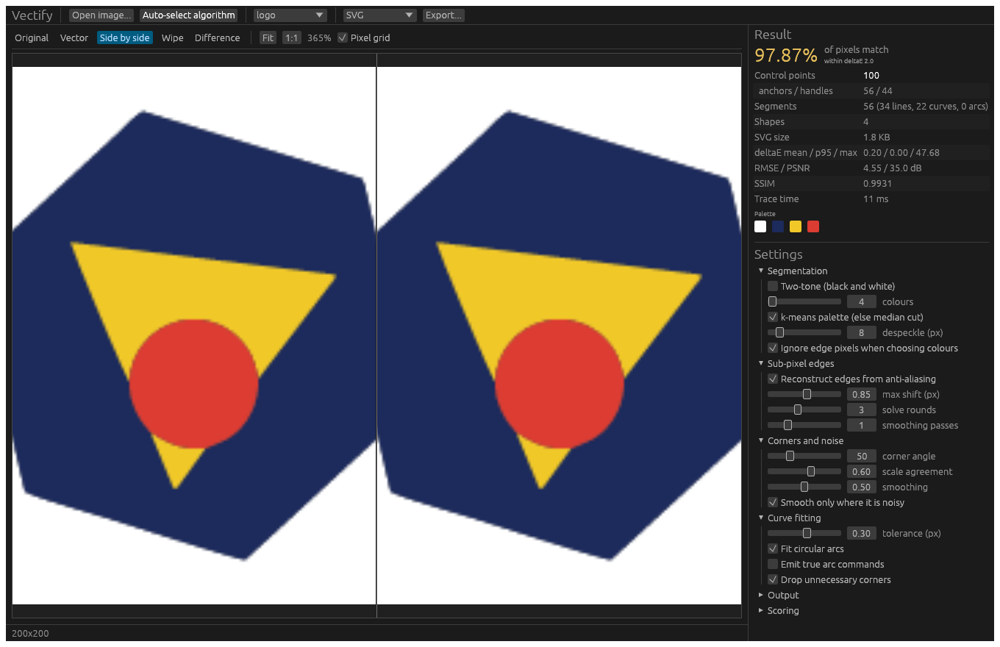

<p align="center">
  
</p>

# Vectify

> [!WARNING]
> **100% vibe coded, one-off tool.** Every line of this project was written by
> an AI assistant from natural-language prompts. It was built to scratch one
> itch, not as a maintained product: expect rough edges, no support, no stability
> guarantees, and no promise of future updates. Use at your own risk, and check
> the output before relying on it.

An open-source raster-to-vector tracer that tries to **invert rasterisation**
rather than outline pixels, with a measurement harness that checks whether it
actually worked. (A *raster* image is a grid of pixels, like a PNG or JPEG; a
*vector* image is built from shapes and curves that stay sharp at any size, like
an SVG. Vectify turns the first into the second.)

Vectify takes essentially any bitmap format, segments it into flat colour
regions, reconstructs where the original shape boundaries fell to sub-pixel
accuracy, fits the fewest curve primitives that hold those boundaries, and
writes SVG, EPS, PDF or DXF. A built-in scorer renders the result back to
pixels and compares it with the input, and an automatic picker uses that scorer
to choose settings by measurement instead of by guesswork.

```
cargo run --release -p vectify-gui                 # desktop app
cargo run --release -p vectify-cli -- --help       # command line
cargo test --release                               # 146 tests
```

---

## Why this is not just an outline tracer

A conventional tracer treats a pixel as a little opaque square and walks around
the blocks. That throws away the most useful information in the image before it
starts. Four things follow from taking that information seriously instead.

### 1. Sub-pixel edge reconstruction

When a rasteriser draws a shape, an edge pixel is set to the area-weighted
average of the colours either side of the boundary. That average is
*invertible*. Knowing the two flanking colours recovers the coverage fraction,
and knowing the coverage fraction and the edge orientation recovers the signed
distance from the pixel centre to the original mathematical edge — in closed
form, not as an approximation.

The geometry is the area of a unit square cut by a half-plane at signed
distance `t`, with the boundary normal at angle `theta` to the axes:

```
A(t) = 0                         t <= -h
     = (t + h)^2 / (2 c s)       -h <= t <= -d
     = 1/2 + t / c               -d <= t <=  d
     = 1 - (h - t)^2 / (2 c s)    d <= t <=  h
     = 1                          t >=  h
```

with `c = cos theta`, `s = sin theta` folded into `[0°, 45°]`, `h = (c+s)/2`,
`d = (c-s)/2`. [`subpixel.rs`](crates/vectify-core/src/subpixel.rs) inverts it.

Two details make it work in practice:

- **Orientation is solved iteratively.** The inversion needs the edge angle,
  but the only angle available on the first pass comes from the raw staircase
  contour, which is badly wrong for shallow slopes. Each round re-measures
  orientation from the previous round's straighter contour.
- **Smoothing is applied to refined positions, never to displacements.** Along a
  slanted edge the correction each staircase vertex needs is a *sawtooth*;
  blurring it flattens exactly the signal the solve just recovered. This cost a
  factor of two in accuracy before it was caught.

Measured on analytically anti-aliased edges
([`subpixel.rs` tests](crates/vectify-core/src/subpixel.rs)):

| edge | pixel-snapped error | reconstructed error |
|---|---|---|
| vertical at x = 20.3 | 0.300 px | < 0.001 px |
| 30° slant | 0.345 px | 0.0005 px |

End to end on an anti-aliased disc, turning the feature off doubles the error:
mean ΔE (a perceptual colour-difference score, lower is better; see Scoring
below) 0.057 with, 0.113 without.

### 2. Primitive arc and line fitting

[`fitting.rs`](crates/vectify-core/src/fitting.rs) is greedy about span length
and cheap about primitives. For each run between corners it tries, in ascending
order of cost:

1. a **straight line** — zero control handles;
2. a **single cubic Bézier** — two handles, fitted by Schneider's least-squares
   method with Newton-Raphson reparameterisation and fixed end tangents;
3. a **true circular arc** — two handles, but able to span far more than one
   cubic, so a three-quarter turn stays one command instead of four;

and only splits the run when none of those fit. Because the widest span is
always tried first, output lands close to the minimum for a given tolerance. A
full circle costs 8 segments; a rectangle costs 4 lines and **zero** handles.

A corner-pruning pass then removes detected corners that turn out not to be
earning their keep, refitting to confirm.

### 3. Shared-edge topology (no "pancakes")

Most multi-colour tracers vectorise each colour separately and stack the
silhouettes. Because each is traced and smoothed independently, a border two
colours are meant to *share* becomes two different curves — hence colour
fringing, gaps, and shapes that tear apart when moved in an editor.

[`topology.rs`](crates/vectify-core/src/topology.rs) builds a genuine planar
subdivision instead. It works on the **crack graph**: the lattice of pixel
corners, with an edge wherever two adjacent pixels belong to different regions.
That graph is cut at junctions (nodes where three or more regions meet) into
maximal chains called *arcs*, each with exactly one region on its left and one
on its right.

Each arc is then refined and fitted **exactly once**, and both adjacent regions
reference that same fitted curve — one forwards, one reversed. Shared borders
are identical by construction rather than by numerical luck, and junctions are
shared vertices. Coordinate rounding happens once, before export, so the
guarantee survives serialisation.

This is enforced by tests, not just intended: `the_shared_border_is_one_arc_referenced_twice`
asserts both regions cite the same arc id in opposite directions.

### 4. Artefact versus corner discrimination

Every tracer must answer, at every vertex: did the artist draw this bend, or did
the encoder? At the finest scale the two are indistinguishable — a 45° staircase
turns 90° at every step, exactly like the corner of a square.

They separate immediately under **scale**
([`corners.rs`](crates/vectify-core/src/corners.rs)). A real corner turns by the
same angle whether measured one pixel out or eight. A staircase or a burst of
compression noise turns sharply at one pixel and not at all at eight. A vertex
is a corner only if it is sharp *persistently*, across scales.

Read the other way, the same measurement gives a per-contour **noise estimate** —
how much fine-scale bend has vanished by coarse scale — and that drives how hard
each contour is smoothed. Clean contours are left alone; noisy ones are unified.
The filter goes where the noise is, instead of being applied blindly to the
whole canvas.

Smoothing uses Taubin's λ/μ scheme rather than plain Laplacian, because
Laplacian shrinkage on a circle is a directly measurable accuracy loss.

### A fifth thing: palette extraction ignores edge pixels

An anti-aliased image contains two different kinds of pixel. Interior pixels
carry real colours; edge pixels carry *blends*. Naive clustering treats them
alike, and the blends — a dense ridge between every pair of adjacent colours —
pull cluster centres off the true colours and earn palette slots of their own,
which appear as halo outlines around every shape.

[`quantize.rs`](crates/vectify-core/src/quantize.rs) weights each pixel by the
flatness of its neighbourhood when choosing the palette. The blends still get
*assigned* afterwards, which is exactly what we want: an edge pixel resolves to
whichever side it is closer to, putting the initial contour on the 50% coverage
line for the sub-pixel solver to refine.

---

## Scoring: what "99% match" means here

The headline metric is deliberately **not** RMSE. RMSE answers "how different
are these numbers" when the question is "can I see the difference", and the two
come apart badly: a one-level shift across a large flat area is invisible but
moves RMSE a lot, while a hard edge displaced by a pixel is glaring and barely
moves it.

So the headline is **the percentage of pixels within a just-noticeable colour
difference**, measured with CIEDE2000 (verified against the Sharma et al.
reference dataset). "99% match" then means something checkable: 99 in 100 pixels
are perceptually indistinguishable from the original. RMSE, PSNR and SSIM are
reported alongside.

Scoring is a genuine round trip. The vector document is serialised to real SVG
and rendered by a real SVG renderer (`resvg`); nothing is graded against the
tracer's own internal contours, which would let a fit mark its own homework.

### The measurement has a ceiling, and it is not 100%

This matters more than it sounds. Even a **perfect** vectorisation — the exact
geometry the image was drawn from — does not reproduce the original pixel for
pixel, because the renderer scoring it anti-aliases slightly differently from
the renderer that made the input. On a high-contrast edge, a coverage difference
of one or two percent already exceeds the visible-difference threshold.

The benchmark therefore scores each scene's own exact geometry to establish the
ceiling, and reports the **gap** to it. Without that, a score of 98.5% is
uninterpretable: it could mean the tracer is 1.5% wrong, or that 1.5% is simply
unreachable. See [`tests/ceiling.rs`](crates/vectify-core/tests/ceiling.rs).

---

## Benchmark

`cargo run --release -p vectify-cli -- bench --auto`

```
case            match%   ceil%    gap  deltaE    pts size KB     ok
------------------------------------------------------------------
hard-rects      100.00  100.00   0.00    0.00     24     0.5    yes
aa-circle        99.17   99.45   0.28    0.06     16     0.4    yes
slants           98.96   99.06   0.10    0.05    182     2.8     NO
junctions        98.61   98.72   0.11    0.12     75     1.4     NO
star             99.10   99.64   0.54    0.07    152     2.4    yes
rings            98.01   97.95  -0.06    0.10     52     1.0     NO
logo             98.47   99.17   0.71    0.13    204     3.3     NO
pixel-art       100.00       -      -    0.24    768     6.1    yes
noisy-shapes     54.92       -      -    2.23    104     1.8     NO
alpha            97.92   98.30   0.38    0.26     40     0.8     NO
gradient         47.47       -      -    2.40   1059    18.0     NO
------------------------------------------------------------------
MEAN                                            2676           4/11
```

Read the `gap` column, not the `ok` column. `ok` only records whether a case
reached the 99% match target; it says nothing about how close it got to what is
achievable, and `junctions` and `rings` cannot say yes at all, because even
their exact geometry scores 98.72% and 97.95%. On the eight cases with known
geometry the ceiling averages 99.04%, and tracing lands **0.26 points below it
on average, 0.71 at worst**. Hard-edged rectangles round-trip *exactly*, with
zero curve handles. An anti-aliased disc costs **16 control points**. The
five-way junction case — the one designed to expose stacked-silhouette seams —
comes within **0.11 points** of perfect.

`rings` scoring above its ceiling is not an error: the reference SVG draws the
annulus with elliptical-arc commands, and the traced cubics happen to land
marginally closer to the supersampled original.

The two bad rows are honest and worth keeping:

- **`noisy-shapes`** — pixel noise is not representable by flat vector regions,
  and should not be. The score is low because the metric is asking us to
  reproduce noise. What matters here is that the picker returns a **104-point,
  1.8 KB** result rather than chasing individual noise pixels.
- **`gradient`** — smooth gradients are the worst case for any flat-region
  tracer. Vectify has no gradient-mesh output, so this is a real limitation, not
  a tuning problem.

---

## The automatic picker

`vectify auto input.png -o out.svg --show-all`

Three stages ([`auto.rs`](crates/vectify-core/src/auto.rs)):

1. **Profile** the image cheaply — colour count, anti-aliasing, flatness — to
   decide which family of settings is even worth trying. The anti-aliasing
   measure cleanly separates pixel art (≈0%) from anti-aliased artwork (25–40%);
   flatness separates continuous-tone images, which need a large palette, from
   noisy flat-colour art, which does not. Colour count alone cannot do this: a
   smooth two-hue gradient has only ~600 distinct colours.
2. **Seed** a spread of configurations and score every one by full round trip.
3. **Refine** the best few by coordinate descent over tolerance, palette size
   and method, smoothing, corner threshold, arcs and despeckling.

### The ranking rule

Stated as the requirement was: **among candidates that hit the fidelity target,
fewest control points wins.** Fidelity is a gate, not something traded away for
compactness.

Two guards stop the fallback branch — used when *nothing* reaches the target —
from behaving pathologically:

- A **point budget** scaled to image size. Beyond it, a result has stopped being
  a vectorisation and ranks below anything that stayed within it.
- A **logarithmic discount**: each doubling of control points must earn 0.25
  percentage points of match to be worth taking.

These are not hypothetical. Without them, on `noisy-shapes` the search bought a
6-point accuracy gain for **36,350 control points** — a 436 KB file for a
180×140 image. With them it returns 104 points and 1.8 KB. Across the suite the
two guards cut total control points **16.5×** with no loss of mean accuracy.

---

## The desktop app

```
cargo run --release -p vectify-gui [image]
```

- Open or drag in any supported raster; export to SVG, EPS, PDF or DXF.
- Live preview with **side-by-side**, **wipe** and **amplified difference**
  views sharing one zoom/pan transform, nearest-neighbour sampled with an
  optional pixel grid, because judging a tracer means counting pixels.
- Every parameter live, with the trace running on a worker thread. The request
  slot holds one pending job, so dragging a slider across twenty values runs the
  one in flight and then jumps to the latest — and stale results are discarded
  rather than overwriting fresher output.
- **Transparent colours**: add one or more colours to leave unpainted (see
  [Transparent colours](#transparent-colours)). "Add colour" starts from the
  image's top-left pixel, which is usually the background.
- **Auto-select algorithm** with a progress bar and a table of every candidate
  tried; click any row to apply it.
- Metrics panel: match %, ΔE mean/p95/max, RMSE, PSNR, SSIM, control points,
  segment breakdown, file size, timings, and the palette actually used.



The GUI is covered by headless tests
([`tests/smoke.rs`](crates/vectify-gui/tests/smoke.rs)) that drive the real
widget tree, including one that renders it offscreen through wgpu.

---

## Command line

```
vectify trace   in.png -o out.svg --colors 8 --tolerance 0.3 --check
vectify auto    in.png -o out.svg --target 99 --show-all --json report.json
vectify score   in.png out.svg            # judge an existing vector file
vectify bench   --auto --out-dir results  # the benchmark above
vectify inspect in.png                    # what the profiler makes of it
vectify gen-testdata testdata             # write the synthetic suite as PNGs
```

`trace` accepts `--preset`, `--binary`, `--threshold`, `--smoothing`,
`--corner-threshold`, `--despeckle`, `--palette`, `--no-subpixel`,
`--true-arcs`, `--no-arcs`, `--recolor`, `--no-group`, `--scale`,
`--precision`, `--transparent` and `--transparent-tolerance`. Output format is
inferred from the extension. `auto` accepts `--transparent` and
`--transparent-tolerance` too.

`trace`, `auto` and `score` also accept `--denoise-reference`, `--denoise-radius`
and `--denoise-sigma`; see [Scoring JPEGs](#scoring-jpegs).

`trace` uses exactly the settings you give it. `auto` tries many settings, scores
each one, and keeps the best, so it needs no tuning but takes longer. If you are
unsure where to start, start with `auto`.

### Scoring JPEGs

A JPEG's blocking and noise count as error against a flat vector region, though
no tracer should reproduce them. `--denoise-reference` (or "Smooth original
before scoring" in the GUI) scores against a **bilateral-filtered** copy of the
original instead. Unlike a box or Gaussian blur, a bilateral filter only averages
pixels that are close in colour, so noise in flat areas is smoothed while edges
stay sharp.

```
vectify score photo.jpg out.svg --denoise-reference
vectify auto  photo.jpg -o out.svg --denoise-reference --denoise-sigma 6
```

- Only the scoring reference is smoothed. The tracer still sees the original.
- Scores measured this way run higher and are **not comparable** with ones that
  were not; results are marked as such.
- `--denoise-sigma` (default 4, in CIELAB units) is the colour difference below
  which neighbours are averaged. Raise it for stronger noise, at the cost of
  softening low-contrast edges in the reference.
- It recovers a lot but not everything. On hard-edged test images saved as
  JPEG, it took a correct trace from ~90% to ~94% at quality 85 and from ~75% to
  ~78% at quality 30. Ringing next to edges and 4:2:0 chroma bleed look like real
  structure to the filter, so heavily compressed images stay well below what
  the same trace scores against the clean source.
- On an image with no JPEG damage the score moves by 0.1 points or less, so it is
  not simply rewarding blur.
- It costs about a second on a 12-megapixel image.

### Transparent colours

```
vectify trace logo.png -o logo.svg --transparent '#ffffff'
vectify trace scan.png -o scan.svg --binary --transparent '#fff,#f4f0e8'
vectify auto  logo.png -o logo.svg --transparent '#fff' --transparent-tolerance 12
```

A colour marked transparent gets **no shape at all**. That is not the same as
painting a white shape and hiding it: the neighbouring shapes end at its border,
and a region of that colour enclosed by a shape leaves a real hole in it.
Because the output is a planar subdivision, nothing else was covering that
area, so leaving it empty is exactly right.

**Which colour, and how close?** Give the colour the background actually is, as
`#rrggbb` or `#rgb`. The command line has no colour picker, so read it off with
any image editor's eyedropper; the desktop app's "Add colour" button starts from
the image's top-left pixel (usually the background) and shows its hex value.
You do not need it exact. `--transparent-tolerance` is how far a colour in the
image may be from yours and still count as it. If the background is still
traced as a shape, raise it; if pale parts of the artwork disappear, lower it.
Move in steps of a few units and re-run.

- **The distance is plain CIELAB distance**, the straight-line gap between two
  colours in the perceptual colour space that Scoring below also builds on. Very
  roughly, 2 is a difference you can barely see side by side and the default of 8
  is small but plain. It is a simpler formula than the CIEDE2000 the scorer
  uses, so the two sets of numbers are not interchangeable.
- **Matching is by tolerance, not equality.** Every colour the tracer settles
  on that lies within the tolerance of a listed colour is left unpainted. Real
  backgrounds are rarely the exact colour asked for, and k-means can split one
  flat background into two clusters; both are caught. If clustering never found
  your colour at all, it is still added to the colour list, and that added entry
  is itself transparent, so pixels closer to it than to any real colour are
  removed. A listed colour that is not in the image at all has no visible effect.
- **Edges are untouched.** Pixels still resolve to their nearest colour, so a
  shape's anti-aliased border against the removed background is reconstructed
  from the real colour contrast, exactly as if the background were painted. The
  surviving shapes are geometrically identical to a trace without
  `--transparent`.
- **Scoring accounts for it.** The scorer compares against the image with the
  pixels of the transparent colours made transparent, so an intentionally absent
  colour is not counted as error, and `auto` does not try to buy it back. That
  comparison image is built from the tolerance alone, so it can differ slightly
  from what was actually removed along anti-aliased fringes.
- It works in colour-palette mode and in two-tone mode (`--binary`, which splits
  the image into just ink and paper and suits line art and scans), and alongside
  real alpha transparency, which is always left unpainted.

---

## Layout

```
crates/vectify-core/src/
  geom.rs        points, path model, arc-to-cubic conversion
  color.rs       sRGB/Lab, CIEDE2000
  raster.rs      loading, sampling, resampling
  quantize.rs    Otsu, edge-weighted k-means, median cut
  segment.rs     label map, connected components, despeckling
  topology.rs    crack graph, shared arcs, region rings      <- no pancakes
  subpixel.rs    coverage inversion                          <- sub-pixel edges
  corners.rs     multi-scale corner detection, Taubin        <- artefact vs corner
  fitting.rs     line/arc/cubic fitting, corner pruning      <- fewest points
  model.rs       output document and complexity metrics
  vectorize.rs   pipeline
  export/        svg, eps, pdf, dxf
  score.rs       round trip, CIEDE2000/RMSE/PSNR/SSIM
  auto.rs        profiling, search, ranking
  synth.rs       synthetic scenes with known ground truth
crates/vectify-cli/    trace / auto / score / bench / inspect
crates/vectify-gui/    eframe desktop app
assets/                logo.png (transparent, full size), icon.png, icon.ico;
                       source/ holds the original the others were made from
```

Pipeline order is not arbitrary: sub-pixel refinement runs **before** corner
detection, because detecting corners on a raw staircase measures the pixel grid
rather than the artwork. Fitting happens once per *arc*, not once per *region*,
which is what makes shared borders identical.

Working colour space is **gamma-encoded sRGB**, not linear light — because
virtually every rasteriser that produced our input images blended anti-aliased
edges in gamma space. To invert rasterisation you must model the blend the way
it actually happened. Linear light is used only where it is genuinely correct,
such as converting to CIELAB.

---

## Formats

| Format | Notes |
|---|---|
| **SVG** | Primary. Optional true arc commands. |
| **EPS** | Level 2, arcs lowered to cubics, nonzero fill. |
| **PDF** | 1.7, single page, hand-built xref (tested for offset correctness). |
| **DXF** | R12 ASCII for CNC/laser/vinyl. Curves are flattened and shapes are written as closed outlines — R12 has no Bézier primitive and no practical fill for nested regions. That is what a cutting workflow wants anyway. |

Input is anything the `image` crate decodes: PNG, JPEG, GIF, BMP, TIFF, WebP,
TGA, ICO, PNM, QOI, DDS, farbfeld, OpenEXR, HDR. Format is detected from content,
so a mislabelled file still loads.

---

## Limitations

- **No gradient or mesh fills.** Smooth gradients are approximated by banded
  flat regions; see the `gradient` benchmark row.
- **Noise is not reproducible** by flat regions, and the round-trip metric will
  always score noisy input poorly even when the vector output is good.
- **No centreline tracing.** Everything is filled-region tracing, so a thin
  stroke becomes a long closed outline rather than a single stroked path.
- **DXF carries outlines, not fills.**
- The auto-picker searches large images on a downscaled copy for speed; winners
  are always re-measured at full resolution, but the *ranking* was decided on
  the downscaled copy. Pass `--search-size 0` to disable.

## Performance

Single-threaded tracing, measured on a 2000x2000 (4 MP) image:

| input | trace time | output |
|---|---|---|
| flat-colour artwork, hard edges | 242 ms | 97 KB, 4 shapes |
| the same, heavily blurred (8 colours) | 377 ms | 541 KB |

Scoring and the auto-picker's candidate search are parallelised with `rayon`.
The picker searches large images on a downscaled proxy by default, so choosing
settings for a multi-megapixel image takes about as long as for a small one.

## Licence

MIT. See [LICENSE-MIT](LICENSE-MIT).
